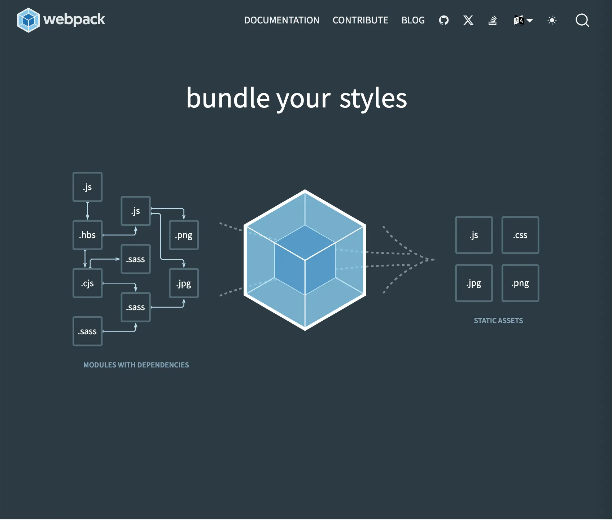
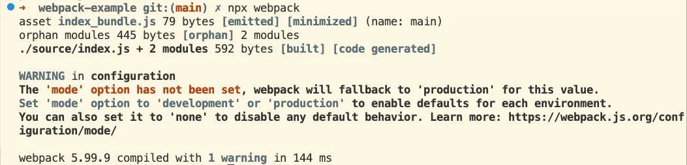

# 1강. 수업소개



- JS, CSS 등 여러 파일을 각각 서버에서 받아야 할수록 앱 로드 속도가 느려진다
  - 네트워크 요청이 많아지면, 요청마다 지연이 발생하고 리소스도 더 많이 소모됨
- 여러 자바스크립트 패키지를 함께 쓰다 보면, 서로 같은 이름의 변수를 사용해서 충돌이 발생할 수 있음
  - 예: 두 패키지에서 모두 `foo`라는 전역 변수를 쓸 때, 값이 덮어써져서 예기치 않은 동작이 발생
- 번들러: 여러 파일(모듈)을 하나로 묶어주는 도구
  - 대표적인 번들러: webpack, browserify, parcel 등
  - JS, CSS, 이미지 등 다양한 파일을 하나의 자바스크립트 파일로 합칠 수 있음
  - 필요하다면, 성능 향상을 위해 일부 코드를 분리해서(코드 스플리팅) 나눠서 불러올 수도 있음

# 2강. 웹팩이전의 세계와 모듈의 개념

- 기술이 없어서 생기는 불편함 때문에 기술이 의미가 있는 것
- 웹팩 없이 웹사이트를 만들어보고, 웹팩을 이해하기 위해 중요한 "모듈"의 개념을 이해해보자
- 문제
  - 최신 JS 문법(예: export/import)은 크롬, 엣지 등 최신 브라우저에서는 동작하지만, 구형 브라우저(예: IE)에서는 동작하지 않음
  - 여러 개의 JS 파일을 각각 서버에서 받아야 하면, 네트워크 요청이 많아지고, 로딩 속도가 느려짐. 또한 파일이 많을수록 브라우저가 처리해야 할 일이 많아져 성능이 저하됨
- 니즈
  - Node.js처럼 JS 파일을 모듈 단위로 개발하고 싶음 (import/export 사용)
  - 실제 서비스에서는 여러 파일을 하나로 묶어서, 네트워크 요청을 최소화하고 싶음
- 해결
  - 웹팩은 여러 개의 JS 파일(모듈)을 하나의 파일로 합쳐주는 도구(번들러)임
  - 웹팩이 알아서 모든 파일을 하나로 합쳐주고, 브라우저가 이해할 수 있는 형태로 변환해 줌
  - 덕분에 개발자는 최신 문법(모듈, import/export 등)을 자유롭게 사용하면서도, 실제 서비스에서는 하나의 JS 파일만 불러오면 됨

# 3강. 웹팩의 도입

- 웹팩을 사용하려면, 현재 프로젝트를 npm 또는 yarn으로 관리되는 node.js 패키지 프로젝트로 만들어야 함

  - 프로젝트에 package.json 파일을 생성 (프로젝트 정보 및 의존성 관리)

  ```javascript
  yarn init
  ```

  - 웹팩과 웹팩 CLI를 개발용(Dev) 의존성으로 설치

  ```
  yarn add -D webpack webpack-cli
  ```

- entry 파일에서 사용하는 모든 파일을 하나로 번들링하는 명령어 예시
  아래 명령어는 ./source/index.js를 시작점으로 모든 의존 파일을 분석해, 결과물을 ./public/index_bundle.js로 생성함

  ```javascript
  npx webpack --entry ./source/index.js --output-path ./public --output-filename index_bundle.js
  ```

# 4강. 설정파일 도입

- https://webpack.js.org/configuration/
- `npx webpack --entry ./source/index.js --output-path ./public --output-filename index_bundle.js` 이렇게 실행했던 것을 config 파일에 설정하자

  ```
  module.exports = {
    entry: "./source/index.js",
    output: {
      path: path.resolve(__dirname, "public"),
      filename: "index_bundle.js",
    },
  };
  ```

  - `__dirname`는 webpack.config.js 파일이 있는 경로

- config를 적용하여 실행
  ```
  npx webpack --config webpack.config.js
  ```
  - `--config webpack.config.js` 부분은 생략가능

# 5강. 모드의 도입

- https://webpack.js.org/configuration/mode/#mode-development

* `npx webpack`을 실행하면 성공은 하는데 경고가 표시됨
  

# 6강. 로더의 도입

- https://webpack.js.org/guides/asset-management/

# 7강. output 설정

- 번들링한 결과를 다양한 형태로 저장할 수 있음

# 8강. 플러그인의 도입

- 로더는 모듈의 최종 output을 만들어가는 과정에서 사용됨. 할 수 있는 일이 제한적.
- 플러그인은 그렇게 만들어진 결과물을 변형함
- 플러그인이 로더보다 더 복합적이고 자유로운 일을 할 수 있음
- 플러그인 마다 사용법이 각각 다름

<details>
<summary>HtmlWebpackPlugin</summary>

- [HtmlWebpackPlugin 공식 문서](https://webpack.js.org/plugins/html-webpack-plugin)

* `rm ./public/*.*`: public 디렉토리 하위 모든 것을 지우기
* webpack.config.js plugins 설정

  ```javascript
  const path = require("path");
  const HtmlWebpackPlugin = require("html-webpack-plugin");

  module.exports = {
    mode: "development",
    entry: { index: "./source/index.js", about: "./source/about.js" },
    output: {
      path: path.resolve(__dirname, "public"),
      filename: "[name]_bundle.js",
    },
    plugins: [
      new HtmlWebpackPlugin({
        template: "./source/index.html",
        filename: "index.html",
        chunks: ["index"],
      }),
      new HtmlWebpackPlugin({
        template: "./source/about.html",
        filename: "about.html",
        chunks: ["about"],
      }),
    ],
  };
  ```

<details>
<summary>HtmlWebpackPlugin config 에 대한 gpt 설명</summary>

#### 1. template

- **역할:** 어떤 HTML 파일을 템플릿(기본 틀)로 사용할지 지정합니다.
- **예시:** `template: "./source/index.html"` → 이 파일을 바탕으로 최종 HTML을 만듭니다.

#### 2. filename

- **역할:** 번들링 결과로 만들어질 HTML 파일의 이름(경로 포함)을 지정합니다.
- **예시:** `filename: "index.html"` → 최종 결과물이 `public/index.html`로 생성됩니다.

#### 3. chunks

- **역할:** 이 HTML 파일에 어떤 JS 번들 파일(엔트리)을 포함할지 지정합니다.
- **예시:** `chunks: ["index"]` → `index_bundle.js`만 이 HTML에 자동으로 `<script>`로 삽입됩니다.
- **추가 설명:** `chunks`에 들어가는 값은 `entry`에서 설정한 key 값(엔트리 이름)입니다.

* **정리 예시**
  ```
  new HtmlWebpackPlugin({
    template: "./source/about.html", // 어떤 HTML을 기본으로 쓸지
    filename: "about.html",          // 결과 HTML 파일 이름
    chunks: ["about"],               // 어떤 JS 번들을 포함할지 (entry의 key 값 사용)
  })
  ```
  - `./source/about.html`을 바탕으로
  - `public/about.html`을 만들고
  - `about_bundle.js`만 script로 자동 삽입

</details>
</details>

# 9강. 선물

`npx webpack --watch`

파일 변경 감지 & 자동 번들링

# 10강.

웹팩이 제공하는 기능

- dev server
  - live reload
  - hot module replacement
- code spliting
- lazy loading
